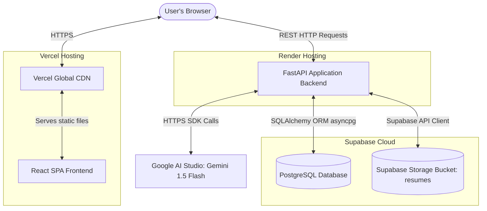
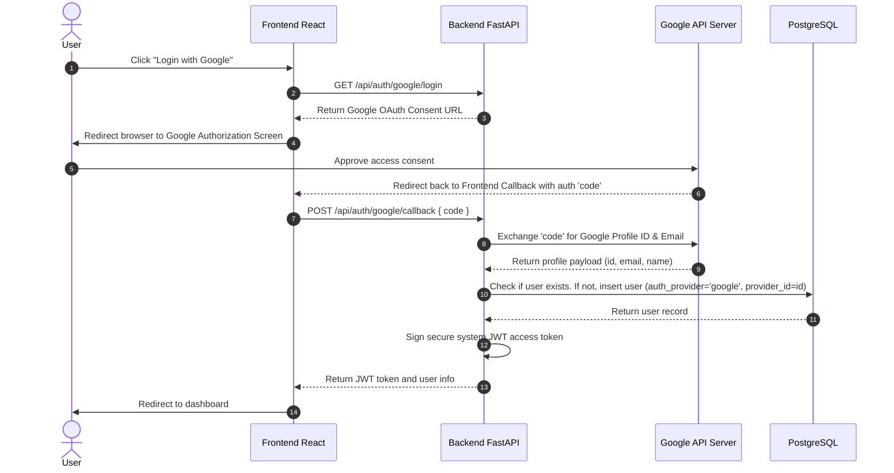
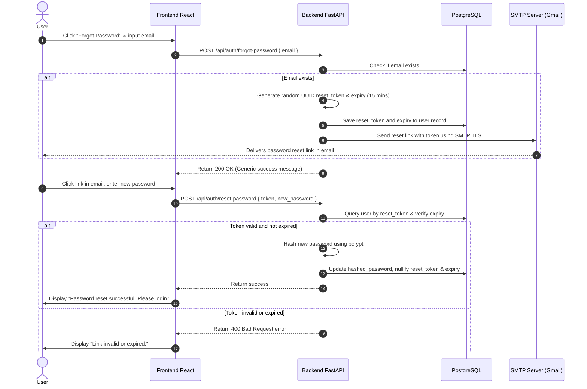
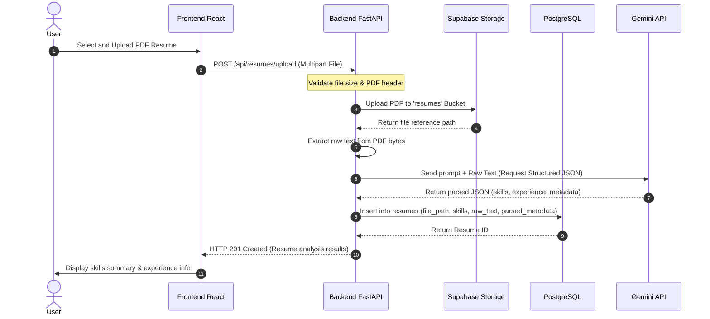
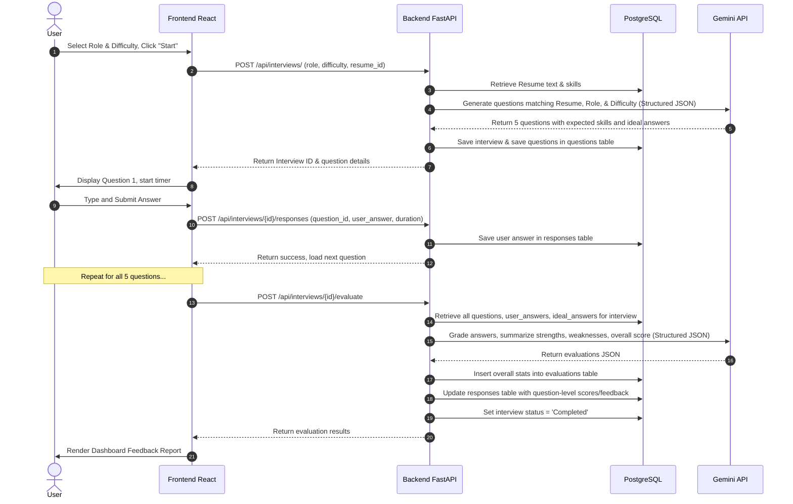

# System Architecture - AI-Powered Mock Interview Platform

This document describes the high-level system components, application layer separation, deployment setup, directory tree layout, and key system data flows for our production-ready free-tier cloud deployment.

---

## 1. System Components Overview

The production architecture distributes components across free-tier hosting networks to minimize operation cost:



1. **Presentation Layer (Vercel CDN / React SPA)**: Serves static CSS, HTML, and compiled JS files. Handles authentication tokens and dashboard navigation.
2. **Application Layer (Render Web Service)**: Runs the FastAPI web application. Exposes endpoint routers for auth, resumes, interviews, evaluations, and history.
3. **Data & Storage Layer (Supabase)**:
   - **PostgreSQL Database**: Relational storage for user tables, interview templates, responses, and scores.
   - **Supabase Storage Bucket**: Secure object bucket to store and retrieve candidate resume PDFs.
4. **Cognitive Layer (Google AI Studio)**: Free-tier Gemini 1.5 Flash endpoint used for fast text extraction, question generation, and answers grading.

---

## 2. Directory and Folder Structure

The repository structure remains clean and modular:

```text
AI-Mock-Interview/
├── docs/                      # Technical Documentation
│   ├── PROJECT_STATUS.md      # Live progress and task list
│   ├── PROJECT_DECISIONS.md   # Architectural & stack rationale
│   ├── API_DOCUMENTATION.md   # Endpoint specs
│   ├── DATABASE_DOCUMENTATION.md # Table schema details
│   └── ARCHITECTURE.md        # This file
├── frontend/                  # React SPA (Vite + Tailwind)
│   ├── src/
│   │   ├── components/        # Reusable UI elements (Buttons, Inputs, Cards)
│   │   ├── context/           # Auth Context, Interview Context
│   │   ├── pages/             # Login, Dashboard, ActiveSession, FeedbackReport
│   │   ├── services/          # API Client calls
│   │   ├── styles/            # Tailwind imports and theme
│   │   ├── App.jsx
│   │   └── main.jsx
│   ├── package.json
│   └── tailwind.config.js
├── backend/                   # FastAPI Backend
│   ├── app/
│   │   ├── auth/              # Registration, Login, JWT tokens
│   │   ├── resume/            # Resume file upload and analysis endpoints
│   │   ├── interview/         # Question generation & session state endpoints
│   │   ├── evaluation/        # Grading & feedback endpoints
│   │   ├── analytics/         # Aggregate dashboard stats
│   │   ├── models/            # SQLAlchemy Database Models
│   │   ├── schemas/           # Pydantic validation schemas
│   │   ├── services/          # Business logic & Gemini API integration
│   │   ├── repositories/      # Database CRUD layer
│   │   ├── core/              # Config, DB Setup, Security (Hashing, JWT)
│   │   └── main.py            # FastAPI entry point
│   ├── tests/                 # pytest backend test suite
│   ├── Dockerfile
│   ├── requirements.txt
│   └── .env
├── database/                  # SQL Schema scripts
│   ├── schema.sql             # SQL DDL Script
│   └── seed.sql               # Initial test data
├── docker/                    # Custom configuration files
│   └── nginx.conf             # Nginx reverse proxy configuration (for local Docker)
├── docker-compose.yml         # Container orchestrator (for local offline dev)
├── .env.example               # Template for environment settings
└── README.md                  # Quickstart manual
```

---

## 3. Core Data Flows

### A. Google OAuth 2.0 Login Flow
How candidates can authenticate with their Google accounts:



### B. Forgot Password Recovery Flow (SMTP)
How users can reset forgotten passwords using email verification:



### C. Resume Upload & Analysis Flow
How resumes are stored in Supabase Storage and parsed by Gemini:



### B. Interview Flow (Generation -> Answers -> Evaluation)
How interview questions are served and evaluated:



---

## 4. Deployment Architecture

### Production Deployment
* **Frontend**: React client statically generated and hosted on **Vercel**.
* **Backend**: FastAPI running inside a Python container on **Render** (free tier).
* **Database**: PostgreSQL hosted on **Supabase**.
* **Object Storage**: S3-compatible cloud buckets hosted on **Supabase Storage**.

### Local Development Option
For local offline testing, the systems can be run using the provided [docker-compose.yml](file:///E:/AI-Mock-Interview/docker-compose.yml):
* **`db` (PostgreSQL container)**: Matches production database schema.
* **`backend` (FastAPI container)**: Connected to the database.
* **`frontend` (React web container)**: Exposes port `80` with Nginx reverse proxying.
